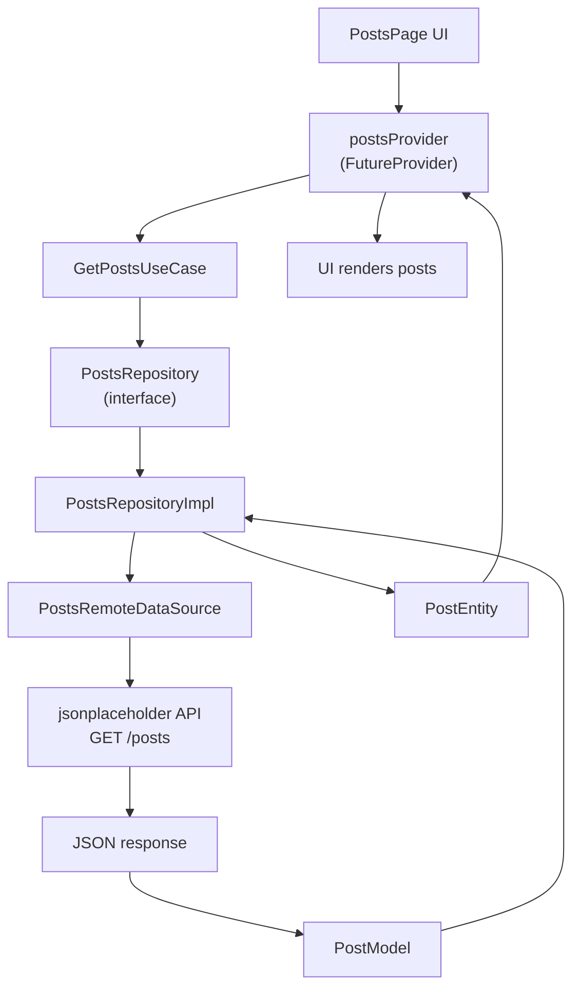

# Posts GET Feature Architecture

This document explains how the `GET /posts` feature is built in this project and how the data flows from the UI to the API and back again.

The feature lives here:
- [`lib/features/example/get-feature`](../example/get-feature)

The endpoint constant lives here:
- [`lib/core/constants/endpoinst.dart`](../../core/constants/endpoinst.dart)

## Big Picture

This feature follows a clean architecture style:

- `presentation` handles UI and Riverpod state
- `domain` defines the business meaning of the feature
- `data` talks to the API and converts raw JSON into app data

The UI does not call the API directly.
Instead, the call flows through Riverpod, use cases, repository contracts, and data sources.

## Full Flow Chart



## What Each Layer Does

### 1. Presentation

Files:
- [`posts_page.dart`](../example/get-feature/presentation/pages/posts_page.dart)
- [`posts_provider.dart`](../example/get-feature/presentation/providers/posts_provider.dart)

Purpose:
- shows the screen
- watches the Riverpod provider
- displays loading, error, and data states

The UI should stay thin.
It should not know how the API works.

### 2. Domain

Files:
- [`post_entity.dart`](../example/get-feature/domain/entities/post_entity.dart)
- [`posts_repository.dart`](../example/get-feature/domain/repositories/posts_repository.dart)
- [`get_posts_use_case.dart`](../example/get-feature/domain/usecases/get_posts_use_case.dart)

Purpose:
- defines the feature meaning
- keeps business logic separate from the API
- tells the app what a post is and what actions are available

The domain layer does not know about:
- Dio
- JSON
- SharedPreferences
- Flutter widgets

### 3. Data

Files:
- [`post_model.dart`](../example/get-feature/data/models/post_model.dart)
- [`posts_remote_data_source.dart`](../example/get-feature/data/datasources/posts_remote_data_source.dart)
- [`posts_repository_impl.dart`](../example/get-feature/data/repositories/posts_repository_impl.dart)

Purpose:
- talks to the API
- parses JSON
- converts raw data into entities
- fulfills the domain repository contract

## Code Flow With Examples

### Step 1: UI asks for data

In the screen:

```dart
final postsAsync = ref.watch(postsProvider);
```

This means the UI is listening to the provider.
When the provider updates, the UI rebuilds.

### Step 2: Riverpod starts the feature flow

In the provider:

```dart
final postsProvider = FutureProvider.autoDispose<List<PostEntity>>((ref) async {
  final useCase = ref.watch(getPostsUseCaseProvider);
  final result = await useCase();

  return result.fold(
    (failure) => throw Exception(failure.message),
    (posts) => posts,
  );
});
```

This provider:
- creates the async state for the UI
- calls the use case
- returns a `List<PostEntity>`

### Step 3: Use case represents the action

```dart
class GetPostsUseCase {
  GetPostsUseCase(this._repository);

  final PostsRepository _repository;

  Future<Either<Failure, List<PostEntity>>> call() {
    return _repository.getPosts();
  }
}
```

This class is the feature action:
- “get the posts”

If the feature logic becomes bigger later, this is where it grows.

### Step 4: Repository contract keeps domain clean

```dart
abstract class PostsRepository {
  Future<Either<Failure, List<PostEntity>>> getPosts();
}
```

This says:
- any posts repository must know how to get posts

It does not say how.
That is the job of the implementation in the data layer.

### Step 5: Repository implementation bridges domain and data

```dart
class PostsRepositoryImpl implements PostsRepository {
  PostsRepositoryImpl(this._remoteDataSource);

  final PostsRemoteDataSource _remoteDataSource;

  @override
  Future<Either<Failure, List<PostEntity>>> getPosts() async {
    final result = await _remoteDataSource.getPosts();

    return result.map(
      (posts) => posts
          .map(
            (post) => PostEntity(
              userId: post.userId,
              id: post.id,
              title: post.title,
              body: post.body,
            ),
          )
          .toList(growable: false),
    );
  }
}
```

This layer:
- gets raw data from the remote source
- converts the data-model objects into domain entities

### Step 6: Remote data source makes the API call

```dart
class PostsRemoteDataSource {
  PostsRemoteDataSource(this._networkService);

  final NetworkService _networkService;

  Future<Either<Failure, List<PostModel>>> getPosts() async {
    final result = await _networkService.get<List<dynamic>>(
      AppEndpoints.jsonPlaceholderPosts,
    );

    return result.map(
      (response) => response
          .whereType<Map>()
          .map((json) => PostModel.fromJson(Map<String, dynamic>.from(json)))
          .toList(growable: false),
    );
  }
}
```

This is the API layer for this feature.
It knows:
- where to call
- how to get the response
- how to convert the response into models

### Step 7: Model parses raw JSON

```dart
factory PostModel.fromJson(Map<String, dynamic> json) {
  return PostModel(
    userId: (json['userId'] as num).toInt(),
    id: (json['id'] as num).toInt(),
    title: json['title'] as String,
    body: json['body'] as String,
  );
}
```

This converts the JSON response into Dart objects.

### Step 8: Entity is the clean app version

```dart
class PostEntity {
  const PostEntity({
    required this.userId,
    required this.id,
    required this.title,
    required this.body,
  });

  final int userId;
  final int id;
  final String title;
  final String body;
}
```

The entity is what the rest of the app should use.
It is not tied to JSON.

## Why This Is Better Than Calling the API in the UI

If the UI called the API directly:
- the screen would become too heavy
- business logic would be mixed with widget code
- testing would be harder
- replacing the API later would be painful

With this structure:
- the UI stays focused on rendering
- the domain layer stays clean and reusable
- the data layer can change later without breaking the UI contract

## Important Riverpod Part

Riverpod is not replacing clean architecture.
Riverpod is connecting the layers together.

In this feature:
- `FutureProvider` gives the UI async state
- `Provider` creates dependencies like the data source and use case
- `ref.watch(...)` keeps the UI reactive

## `read` vs `watch` in This Feature

### `watch`

Used when the UI should react to updates:

```dart
final postsAsync = ref.watch(postsProvider);
```

### `read`

Used when I only want to get a dependency once:

```dart
final networkService = ref.read(networkServiceProvider);
```

The repository and use case providers use `read` because they are wiring dependencies together.

## The Domain Layer, Clearly

The domain layer is **not** the UI layer.
It is also **not** the API layer.

It is the layer where the feature’s meaning lives.

For this feature, the domain layer answers:
- What is a post?
- How do I ask for posts?
- What is the action for getting posts?

So the domain layer is the center of the feature.

## If I Remove the API Later

If later I want to use:
- local cache
- SQLite
- shared preferences
- offline-first syncing

I can keep the UI and domain mostly the same and swap the data implementation.

That is one of the main wins of this architecture.

## One-Sentence Summary

This feature uses Riverpod to connect the UI to a clean architecture flow where the domain layer defines the feature, the data layer fetches the API response, and the UI only watches the final async state.
