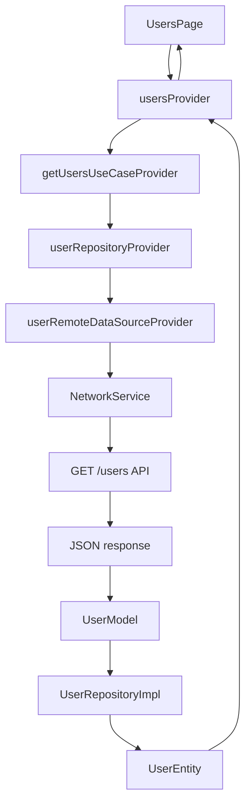

# Get User Feature: Connecting The Dots

This document explains how the user feature is connected from the UI down to the API and back again.

## What I Am Trying To Understand

- where the API call happens
- who returns the data
- how the layers depend on each other
- which provider the UI watches

## Flow Chart



## Simple Explanation

### 1. `UsersPage`
This is the screen.
It does not call the API directly.

### 2. `usersProvider`
This is the provider the UI watches.
It starts the flow and gives loading, error, or data.

### 3. `getUsersUseCaseProvider`
This creates the use case.
The use case is the feature action.

### 4. `userRepositoryProvider`
This creates the repository implementation.
It connects the domain contract to the data layer.

### 5. `userRemoteDataSourceProvider`
This creates the remote data source.
This is where the API call is made.

### 6. `NetworkService`
This performs the HTTP request.

### 7. API
The API returns JSON.

### 8. `UserModel`
The JSON is converted into models.

### 9. `UserRepositoryImpl`
The models are converted into entities.

### 10. `UserEntity`
This is the clean app object.
The use case and UI work with this.

## Why Each Provider Depends On The Next One

- `usersProvider` depends on `getUsersUseCaseProvider` because it needs the use case to start the feature
- `getUsersUseCaseProvider` depends on `userRepositoryProvider` because it needs the repository to ask for users
- `userRepositoryProvider` depends on `userRemoteDataSourceProvider` because it needs the data source to fetch raw user data
- `userRemoteDataSourceProvider` depends on `networkServiceProvider` because it needs the network service to make the request

## What The UI Actually Watches

The UI usually only watches:

```dart
ref.watch(usersProvider);
```

That is enough for the screen.

The other providers are support layers below it.

## Short Version

```text
UI -> usersProvider -> use case -> repository -> remote data source -> API -> model -> entity -> UI
```
