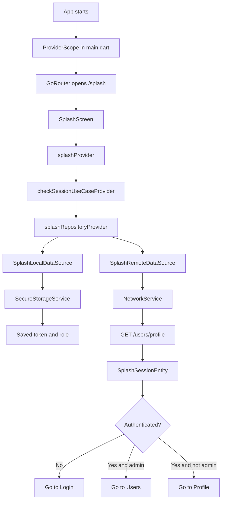

# Splash Feature Flow

This page checks the app session when the app starts, then sends the user to the right screen.

## Main Flow



## Simple Explanation

1. The app starts in [`lib/main.dart`](../../main.dart).
2. `ProviderScope` enables Riverpod for the whole app.
3. [`lib/core/router/app_router.dart`](../../core/router/app_router.dart) opens the splash route first.
4. [`SplashScreen`](presentation/pages/splash_screen.dart) watches `splashProvider`.
5. `splashProvider` calls `checkSessionUseCaseProvider`.
6. The use case calls the repository.
7. The repository checks local storage first.
8. If a token exists, it asks the remote data source to fetch the profile.
9. The result becomes a [`SplashSessionEntity`](domain/entities/splash_session_entity.dart).
10. The splash screen decides where to go next.

## What Each File Does

- [`presentation/pages/splash_screen.dart`](presentation/pages/splash_screen.dart): shows the loading screen and redirects after the session is resolved
- [`presentation/providers/splash_provider.dart`](presentation/providers/splash_provider.dart): wires the UI to the use case
- [`domain/usecases/check_session_use_case.dart`](domain/usecases/check_session_use_case.dart): defines the action "check session"
- [`domain/repositories/splash_repository.dart`](domain/repositories/splash_repository.dart): defines the contract
- [`data/repositories/splash_repository_impl.dart`](data/repositories/splash_repository_impl.dart): contains the real session logic
- [`data/datasources/local/splash_local_data_source.dart`](data/datasources/local/splash_local_data_source.dart): reads and clears token/role from secure storage
- [`data/datasources/remote/splash_remote_data_source.dart`](data/datasources/remote/splash_remote_data_source.dart): calls the profile API

## Decision Rules

- no token = go to login
- token exists and profile says admin = go to users
- token exists and profile says normal user = go to profile
- anything broken = clear session and go to login

## Tiny Mental Model

```text
SplashScreen -> provider -> use case -> repository -> data sources -> decide next route
```
